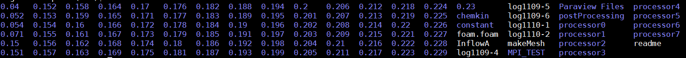
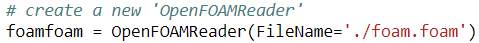

# Python-automation-for-python-processes

A Guide to Automation of Producing Images/Movies from OpenFoam Data on Stampede 2

Step 1: You should have the data from OpenFoam in a folder/directory in your work directory

a. Make sure you have an empty foam.foam file in the folder

Step 2: The .py file containing the python code for the desired image/movie should also be in this folder

Step 3: Load the paraview module (as well as the swr and qt5 modules required for paraview)

a. ‘module load swr qt5 paraview’ (use ‘module list’ to make sure they were loaded)

Step 4: Modify the necessary lines in the code based on the image you want to produce. To open the file just input “vi example.py” into the command module. Hit i to enter editing mode and escape to exit editing mode. “:wq” saves changes and “:q” quits without saving

a. Specify the right path for the foam.foam file (around line 15). The current code will work if foam.foam is in your current directory

b. To change the variable being displayed (the default is temperature) change all lines of code that look like the following to the desired property. There should be only one instance of getting the color transfer for both 2D and 3D, but four instances of coloring a slice/clip in the 3D code and one instance in the 2D code (these will not all be next to one another)

c. The titles of the axes can be easily modified by altering the following lines in the code. You may have to adjust the font sizes and the inflate factor to get the image to look right:
- For 2D code there will only be the two axes 

d. You may also want to adjust the color bar to get it to look professional, the scaling is kind of weird on Linux so if intermediate numbers between the max and min range are not displaying just increase the length. The following code is where most aspects of the color bar can be modified: 
- Note: the RescaleTransferFunction lines set a fixed range for the color bar. You will almost certainly have to change this range with different sets of data or when you are examining different variables

e. If you want to change the camera angle (most relevant for 3D) play with the numbers in the following code until you get what you want. This code repeats several times so make sure you are altering this only the final time it shows up

f. The code, especially for the 3D plot, works correctly only for a specific orientation of the data in paraview (with respect to the x, y, and z axes). To this end the code may not produce clips in the correct orientation and therefore produce a flawed image. To fix this, adjust the coordinates specifying how the clips/slices are created in the code. This is highly dependent on the situation, but some good old fashioned trial and error should fix it up pretty quick. All you should have to alter are the coordinates for the origin of each slice/clip by changing which axes are set as 0 for some or all slices

g. The axes aren’t always properly formatted (often the only default mark on the axis is at 0). Because of this you may need to add code similar to the following:
 
These lines are already in the 2D code but not the 3D code (which will also require specifying a custom Y axis and Z axis). The data scaling (first line) just scales between the x, y, and z axes. Sometimes the axes won’t display if one of the axes is not scaled differently from the others. This is another case where trial and error may be required to get the image looking properly. As mentioned before when doing trial and error just save one jpg image screenshot and comment out the save animation line to save time.

Step 5: Begin an interactive session with ‘idev’

Step 6: Run the .py file with python 
- ‘python example.py’ 
- The code writes a jpg (or whatever image format is being used) for each frame selected to the current folder. The above code creates 21 jpg images starting at 3DAnimation.0000.jpg and ending with 3DAnimation.0020.jpg and saves them to the current directory. If desired you can change the path to write the .jpg images to a different directory
- If you are testing and only want to write one jpg image comment out this line and uncomment the line above it which saves one image

Step 7: Create a new directory and copy/move all of the image files you have created to that directory. Then run:

-This creates a gif called movie.gif out of all of jpg images in the folder (in order)

Step 8: If an alternative video format is desired, download the .gif to your computer and use online software to convert it
- Note: The globus file transfer system is very easy to use and is recommended for easily getting the .gif file on your computer

